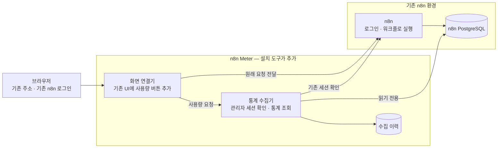

# n8n Meter

**기존 n8n을 쉽고 간단하게 개선합니다.** 워크플로 옆에 `사용량` 버튼을 붙여 실행 통계와 집계 기준을 확인합니다.

기존 주소와 n8n 로그인을 그대로 사용합니다. Chrome 확장이나 별도 계정을 만들 필요가 없습니다. 통계는 기존 n8n의 owner/admin만 볼 수 있습니다.

> 현재 간편 설치 범위: **n8n 2.26.9 · PostgreSQL · 단일 Docker Compose · 네트워크 1개 · 고정 HTTP 포트 1개**. UI와 내부 통계 구조에 의존하므로 n8n 업그레이드 전에 [호환성 확인](COMPATIBILITY.md)이 필요합니다. 라이선스 최종 청구 건수를 보장하는 도구는 아닙니다.

## 빠르게 설치하기

```sh
git clone https://github.com/alsrl8/n8n-meter.git
cd n8n-meter
./install.sh /path/to/n8n/compose.yaml
```

설치 도구가 n8n 서비스·기존 포트·DB 주소를 읽고, **적용할 구성을 먼저 보여줍니다.** 확인 후 적용하며 오래 걸리는 단계는 경과 시간을 표시합니다.

```text
[1/5] 기존 n8n 구성 확인
[2/5] n8n 서비스 n8n · 기존 포트 5678 유지 · 기존 로그인 사용
      DB: postgres / n8n · 읽기 계정: n8nmeter_reader
      추가: 수집기 + 화면 연결기 (2개 컨테이너)
      원본 Compose: 수정 없음
      영향: n8n 포트 연결을 옮길 때 잠시 재시작
[3/5] 필요한 이미지 준비와 읽기 전용 DB 접근 확인
[4/5] 기존 주소에 연결 · n8n이 잠시 재시작됩니다
[5/5] 설치 완료 · 기존 n8n 주소를 새로고침하세요
```

**준비할 것 한 가지:** 읽기 전용 DB 계정의 비밀번호가 담긴 **서버 내 파일 경로**입니다. 이미 있으면 그대로 참조합니다. 비밀번호를 화면에 출력하거나 다른 서버에 전달하지 않습니다. 계정이 없다면 DB 관리자가 [읽기 계정 준비](docs/advanced-install.md#읽기-계정-준비)를 먼저 해야 합니다. n8n의 쓰기 계정으로 우회하지 않습니다.

호스트의 기본 Unix 도구 외에 Bash와 Docker Compose 2.24.4 이상만 필요합니다. Python·Node.js·jq·yq나 설치용 컨테이너를 추가로 설치하지 않습니다. 첫 설치는 이미지·패키지를 다운로드해 빌드합니다. 설치 전 확인만 하거나, 이후 상태를 보고 되돌릴 수 있습니다.

```sh
# 계획만 확인: 실행 중인 n8n을 변경하지 않음
./install.sh /path/to/n8n/compose.yaml --reader-secret /path/to/reader-password --check
# 설치 상태
./install.sh /path/to/n8n/compose.yaml --status
# 원래 연결로 복구: 통계 데이터는 보존
./install.sh /path/to/n8n/compose.yaml --remove
```

설치 후에는 원래 n8n Compose 명령만 실행하면 포트 설정이 충돌할 수 있습니다. 추가 설정은 `.local/compose.meter.yaml`에 보관됩니다. 이후 변경도 이 파일을 함께 적용하거나, 먼저 `--remove`로 복구하세요. 여러 Compose 파일을 조합한 환경은 간편 설치가 자동 변경하지 않습니다.

## 어떻게 붙나요?



두 컨테이너가 추가되지만 **새 주소·새 계정·새 관리 화면은 없습니다.** 기존 n8n은 실행과 로그인을 계속 담당합니다. 수집기는 DB 통계만 읽으며 실행 본문·라이선스 인증서를 가져오지 않습니다. 브라우저 요청 때 n8n에 세션을 확인하고, 관리자 권한과 MFA 완료 여부를 검사합니다.

## 지원 범위와 검증

간편 설치는 단일 Compose 환경부터 지원합니다. Helm/Kubernetes, Ingress·SSO·TLS·서브경로·queue mode는 [고급 설치](docs/advanced-install.md)를 참고하고 환경별로 검증해야 합니다. 지원하지 않는 구성은 서비스 변경 전에 중단합니다.

수집 통계에는 실패한 실행과 버전별 Error Workflow 집계가 포함될 수 있습니다. 보존 기간이 다른 Insights나 Usage and plan과 숫자가 같다고 단정하지 않습니다. 자세한 집계 기준과 실제 확인 범위는 [검증 기록](VERIFICATION.md)에 적습니다.

[기여 안내](CONTRIBUTING.md) · [MIT License](LICENSE)
